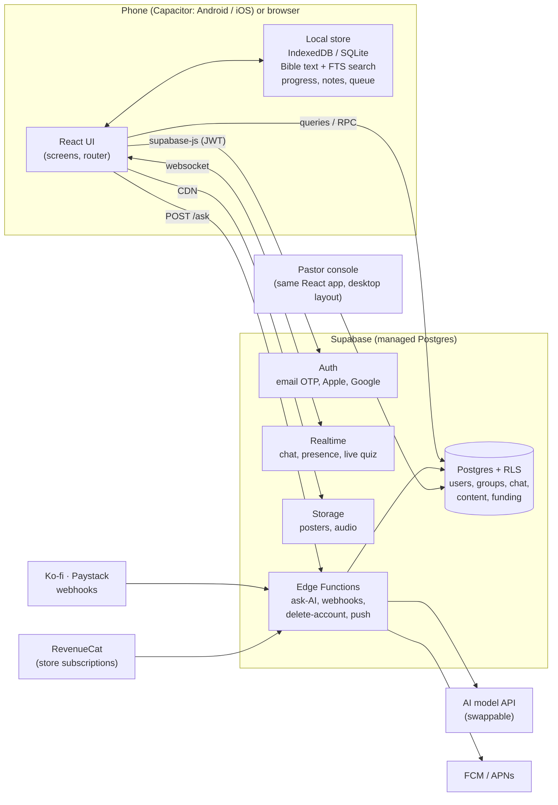
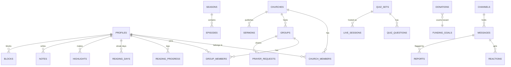

# 2 · Architecture

The design goal is unusual: **one person must be able to build it, run it, and sleep.**
So every choice below favours boring, well-documented, cheap-to-start technology, and
avoids anything that needs a team to operate.

## Principles

1. **One codebase** for web, Android and iOS. You cannot maintain three apps alone.
2. **Guest-first.** A visitor reads with no account. Sign-up appears only when they want
   something that needs one (sync, groups, chat). Local data merges into the new account.
3. **Offline-first for reading.** Scripture, progress, highlights and notes work on a
   2 GB Android phone on a weak network. Your likely first users are on exactly that phone.
4. **Safe by default.** Access rules live in the database (row-level security), not in
   app code the user can bypass. The client is untrusted.
5. **Swappable providers.** AI model, Bible source, payment processor, push service each
   sit behind one small interface, because prices and policies change.
6. **Faith data is sensitive data.** What someone reads, prays and asks reveals their
   beliefs. Collect the minimum; never sell or share it.

## Big picture



## Decisions and why

### Client: keep React + Vite, wrap with **Capacitor**

| Option | Verdict |
|---|---|
| **Capacitor** wrapping the existing React app | **Chosen.** Reuses 100% of what you built; one codebase for web + Android + iOS; native plugins for push, share, haptics, filesystem |
| React Native / Expo | Better raw feel, but a **rewrite of every screen** and a second UI stack. Revisit only if profiling shows Capacitor can't hit performance on low-end phones |
| Flutter | Rewrite in Dart. No |
| PWA only | Great as a *companion* (free, instant, shareable link), but no reliable push on iOS, weak store discoverability, and your users expect the app in the Play Store |

**Risk to manage:** Apple rejects apps that are "just a website" (guideline 4.2). Berean
clears the bar only if it has real native behaviour: local notifications, push, share
sheet, haptics, on-device offline library, widgets later. See
[04-MOBILE-LAUNCH.md](04-MOBILE-LAUNCH.md).

### Backend: **Supabase**

| Option | Verdict |
|---|---|
| **Supabase** (Postgres + Auth + Realtime + Storage + Edge Functions) | **Chosen.** Your data is *relational* (churches → groups → members → roles → messages), which is exactly what Postgres and row-level security are for. Open source, so you are never locked in. Free tier to build; a flat monthly plan to launch |
| Firebase | Strong for realtime and push, but document-database permissions get painful for church/group roles, and chat cost scales per read. Harder to leave |
| Convex / Appwrite | Viable; smaller ecosystems and fewer answers when you're stuck at 2 a.m. |
| Custom Node + Postgres | You'd rebuild auth, realtime and file storage. That is a job, not a saving |

Working assumptions (**verify current quotas and prices before you rely on them**): a
free tier for development, which *pauses inactive projects*, and a Pro plan around
$25/month per project for production.

### Bible text: **ship it inside the app**

| Translation | Licence | Notes |
|---|---|---|
| **Berean Standard Bible (BSB)** | Public domain (CC0, since 30 Apr 2023) | Modern English, readable, and its publishers *invite apps carrying the verbatim text to use the Berean name*. Best default for a modern reader |
| **World English Bible (WEB)** | Public domain | Modern English fallback |
| **King James Version** | Public domain in the US and most places; the UK Crown holds letters patent, so check if you distribute there | Keep: familiar, and your glossary already explains its archaic words |
| ESV, NIV, NLT, NKJV… | Copyrighted | Need a licence. YouVersion Platform (free to build on within its licence) or API.Bible (commercial licensing per translation, priced by reach; the free tier is *non-commercial only*). Read the terms; "free API" ≠ "free to ship" |
| Other languages | Many public-domain and open-licence Bibles exist (e.g., via the Free Use Bible API and eBible.org) | Twi/Ga/Ewe/Yoruba/Swahili etc. depend on what is openly licensed. Research per language |

**Recommendation:** change the default from KJV to **BSB**. It removes the biggest
readability barrier for lapsed readers, matches your name, and costs nothing. Keep KJV as
an option.

**How to ship it:** a build script converts the source text into one compact file per
translation (~4–5 MB raw each, well under 2 MB compressed), stored in **SQLite with FTS5**
on device so verse search is instant and offline. This removes the third-party API
(assessment finding #3) and makes chapter loading instant.

Sources: [BSB licence](https://freethegospel.com/bsb/),
[API.Bible plans](https://faith.tools/app/494-api-bible),
[YouVersion Platform](https://www.youversion.com/news/introducing-youversion-platform).

### Auth

Email one-time code (no passwords to leak or forget), **Sign in with Apple** and **Google**.
Apple *requires* an equivalent privacy-preserving option if you offer Google sign-in.
Guest → account upgrade keeps local progress. Minimum age 13, captured as an `age_band`,
with no kids' mode at launch (kids' apps trigger a much stricter tier of store rules).

## Data model

The full schema is `supabase/migrations/0001_init.sql`. It is built and tested, not sketched.



| Domain | Tables |
|---|---|
| Identity | `profiles`, `app_staff` |
| Churches & groups | `churches`, `church_members`, `groups`, `group_members` |
| Content | `seasons`, `episodes` (with a `scenes` field reserved for cinematic beats) |
| Personal reading | `reading_progress`, `episode_progress`, `reading_days`, `highlights`, `notes`, `saved_questions` |
| Community | `channels`, `messages`, `reactions`, `prayer_requests`, `prayer_events` |
| Safety | `blocks`, `reports` |
| Games | `quiz_sets`, `quiz_questions`, `daily_challenges`, `game_scores`, `live_sessions`, `live_players` |
| Pastors | `sermons` |
| Money | `donations`, `funding_goals`, `entitlements`, plus public views `funding_public` and `supporters_wall` |
| Other | `push_tokens` |

### Security rules that are enforced *in the database* (and tested)

| Rule | How |
|---|---|
| Your notes, progress and highlights are private | RLS: `user_id = auth.uid()` |
| Only group members read a group's chat and prayer | `is_group_member()` inside policies |
| **Anonymous prayer requests really are anonymous** | Members read a view that nulls the author; the raw API never returns it |
| A church admin can't read individual members' reading | Only aggregates via `church_weekly_stats()`, only for members who **opted in**, and suppressed below 5 people so tiny groups can't be de-anonymised |
| You can't promote yourself to pastor, staff, or supporter | No client INSERT policy; roles change only via functions or webhooks |
| Users can't un-hide a moderated message or move themselves between churches | Guard triggers on `messages` and `profiles` |
| Chat flooding | 20 messages/minute/user trigger |
| A church's join code isn't public | Column-level privilege plus `church_join_code()` for staff |
| Donations and entitlements can only be written by server webhooks | RLS on, no client policy |
| Streak cheating is limited | `log_reading()` accepts today ±1 day only |
| Account deletion | `request_account_deletion()` anonymises everything public at once; an Edge Function then removes the login |

`npm run test:db` runs the migration against an in-process Postgres and attempts each
attack above (36 checks). Running it caught two ordering bugs in the migration itself, and
writing it prompted a security review that closed four holes in my first draft (un-hiding
moderated messages, self-assigning a church, anonymous prayer leaking its author, and
infinite policy recursion in live quizzes). **Add a test whenever you add a table.**

## Client architecture

```
src/
  app/            providers, router, session
  features/       one folder per product area, each owns its screens + hooks
    read/  seasons/  room/  groups/  play/  studio/  support/  me/
  data/           repositories (the only place that knows Supabase exists)
    local/        IndexedDB/SQLite implementation (guest, offline)
    remote/       Supabase implementation
    sync/         offline queue: write locally → flush when online
  content/        seasons as files in git, validated in CI
  ui/             design system (Card, Pill, Mark…)
```

- **Router:** React Router or TanStack Router (hash or memory mode for Capacitor). Gives
  deep links (`/read/JHN.3.16`, `/episode/s2e4`) and the Android back button.
- **Server state:** TanStack Query with a persisted cache. **UI state:** small local stores.
- **Repository pattern:** screens call `progress.markChapter()`, never `supabase.from(...)`.
  A `LocalRepo` serves guests; a `RemoteRepo` serves accounts. This is what makes
  guest-first, offline-first and "upgrade to account" possible without rewriting screens.
- **Sync rule:** reading data is *append-mostly*: chapters read are a union, highlights are
  last-write-wins per verse, and `log_reading()` is idempotent, so retries are safe.

## Realtime

| Need | Mechanism |
|---|---|
| Room and group chat | Realtime subscription on `messages` for the current channel |
| **"N reading now"**: a *real* count | Realtime **Presence** on a channel. Replaces the invented number |
| Live quiz (Kahoot-style) | Realtime **Broadcast**; answers verified server-side |
| Push when offline | Edge Function → FCM (Android) / APNs (iOS) |

Design for cost and abuse: one channel per room, unsubscribe when the screen closes,
sample presence counts above a few hundred, and cap message length.

## AI "Ask": a gateway, not a widget

Replace the open Worker with an **authenticated Edge Function**:

1. Require a signed-in (or device-attested guest) user; enforce a **daily quota** per user.
2. **Retrieval first:** look up the verse or chapter in *your own* Bible text and put it in
   the prompt, so the model quotes what is on the page.
3. Ask the model for structured output: `{answer, refs[]}`.
4. **Verify every reference** exists and parses; drop or flag any that don't. This is the
   guard against invented verses, the most damaging failure for this product.
5. Cache common questions. Log (with consent) for review.
6. Keep your current rules: cite Scripture first, admit uncertainty, never claim to speak
   for God, refer personal or pastoral matters to a pastor.
7. Handle self-harm and abuse disclosures with a fixed, kind response and crisis resources.

Order-of-magnitude cost, assuming a small "mini"-class model at roughly 600 tokens in /
250 out (**verify current pricing**): well under a cent per hundred questions. At 20,000
questions a day that is on the order of a few dollars a day, before caching. It scales with
readers, so this is where the "Where it goes" line on the funding page grows first.

## Content pipeline: how seasons get made

Authoring is your bottleneck, not code. A season is: title, tagline, poster, and 6–12
episodes, each with book/chapter, a synopsis and a *next time on…* line.

- **Now:** seasons as versioned files in git, validated in CI (every reference must exist).
- **Next:** the `editor` staff role plus `draft → review → published` states already in the
  schema. Guest authors (pastors, teachers) submit; you approve.
- **AI can draft, humans must approve.** Synopses and discussion questions are
  theology. Have a small review panel (3–5 people, different traditions) sign off.
- **"Read like a movie" upgrade:** split a chapter into *beats* (`episodes.scenes`),
  each with a caption, ambient art or mood, and optional narration, and progress by beat.
  Original art only; avoid depicting Jesus in ways that alienate whole cultures.

## Safety and moderation (required, not optional)

| Layer | What |
|---|---|
| Prevent | 13+, no DMs at launch, message limits, links restricted for new accounts |
| Detect | Keyword filter + a free moderation API on message create |
| Report | Report button on every message → `reports` |
| Block | `blocks` hides a person everywhere for you |
| Act | Auto-hide after N reports; moderator queue (start: Supabase Studio; later a tiny admin page) |
| Support | Published contact address and response promise (store requirement) |
| Care | Prayer is private by default; crisis keywords surface a resources card |

## Privacy and legal (get a local lawyer to confirm)

- **Religious belief is a special category of personal data** under GDPR-style laws.
  That means explicit consent, minimum collection, and a real privacy policy.
- Ghana's Data Protection Act, 2012 (Act 843) and Nigeria's NDPA 2023 apply if you serve
  those users; Ghana expects data controllers to register with its Data Protection
  Commission. **Verify with a local lawyer** before launch.
- Required by the stores: privacy policy URL, data-safety/nutrition labels, account
  deletion in-app *and* on the web.

## Operations for one person

| Concern | Tool |
|---|---|
| Errors | Sentry (free tier) |
| Product analytics and flags | PostHog (privacy-friendly; can self-host) |
| CI | GitHub Actions: typecheck, build, `test:db` on every push |
| Builds | Android on GitHub Actions; **iOS needs macOS**: use a cloud Mac (Codemagic or GitHub macOS runners) if you don't own one |
| Backups | Supabase daily backups on Pro; test a restore once |
| Uptime | A free uptime monitor hitting one health function |
| Secrets | Only in Edge Function secrets and CI. **Never in `VITE_*` variables**: the client is public |

## Rough monthly running cost (estimates)

| Stage | Users | Estimate | Comment |
|---|---|---|---|
| Build | 0 | $0 | Free tiers |
| Launch | ≤ 1,000 active | ≈ $55 | Supabase Pro + Apple fee amortised + small AI + domain (matches the funding page) |
| Traction | ~10,000 active | ≈ $100–300 | AI and realtime usage dominate; caching matters |
| Scale | 100,000+ active | Needs its own plan | Revisit plan, realtime sharding, CDN. A good problem to have |

## Migration path from the prototype (strangler pattern)

Do it in this order so the app is never broken:
router → repositories over the *current* local storage → bundled Bible text →
Supabase auth + sync of progress → real chat → groups → AI gateway → pastor features.
Each step ships on its own. See [06-ROADMAP.md](06-ROADMAP.md).
