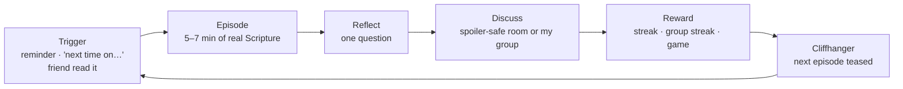
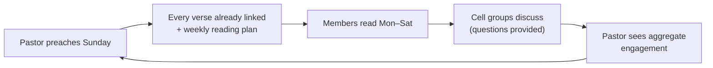

# 5 · Product vision and features

## The idea, in one sentence

> **Berean makes the Bible a series you keep up with, and talk about with people you know.**

Not "a Bible app": there are excellent ones. Berean answers a different question:
*why would I open my Bible tomorrow?* The answer is **an appointment** (the next episode),
**a person** (my group is reading it too), and **a small win** (streak, game, answered question).

Everything on this list is judged by one test: **does it get a lapsed reader to open
Scripture again this week?** If it doesn't serve reading, it waits.

## Who it's for

| Persona | Situation | What they need |
|---|---|---|
| **The Lapsed**: your core | Believes, goes to church, hasn't opened their Bible on their own in months | A tiny, low-guilt way back. 5-minute episodes; a friend to read with |
| **The Streaker** | Already reads; loves progress | Depth, plans, stats, memory tools |
| **The Group Leader** | Runs a cell group / youth / Sunday school | Shared reading, prayer list, discussion questions, live quiz |
| **The Pastor** | Preaches weekly; wants people to *live* the sermon | Publish Sunday's passages, weekly plan, see aggregate engagement |
| **The Explorer** | Curious about faith, not yet a believer | Gentle entry, honest answers, zero pressure |
| **The Teen** | Lives in games and group chats | Games, streaks with friends, short formats |

## The core loop (the "Berean Loop")

And the **church loop**, which is your business model:

## Feature catalogue

**Legend**: **Impact** H/M/L on getting people back to Scripture · **Effort** S (days) / M
(1–3 weeks) / L (a month+) · **Phase** refers to [06-ROADMAP.md](06-ROADMAP.md) ·
✅ exists in the prototype · 🟡 partly.

### A. Read it like a movie *(your signature)*

**The path (built 2026-10-01).** Berean is a series, not a shelf, and everyone starts at the same
place:

- A new reader begins at **Season 1, Episode 1**. The welcome screen, Home, the mirror prompt and
  the reader all point at the same next episode (`nextEpisode()`), so nothing can start them
  somewhere else.
- **Seasons unlock in order.** Season *n* opens when Season *n−1* is finished. Two rules keep it
  fair: a season that has already been begun is **never** taken away, and the **Bible itself is
  never locked** — the reader, the verse of the day, the games, saved verses and search stay open
  at every point.
- **Inside an unlocked season**, episodes open one after another: finish one and the next is
  waiting. Locked episodes still let you read the chapter and mark it as read; they just do not
  stand as the episode.
- Locks always say **what opens them** ("Finish Season 1 — six episodes left"), pointing at the
  earliest unfinished season, which is the one the reader can actually work on.
- Progress is remembered as finished episode ids (`done` in `src/app/store.tsx`), and the path is
  derived from it in `src/app/seasonPath.ts` — never stored twice, so it cannot drift. On device
  it lives in `berean:app:v3`; with accounts it is exactly `episode_progress` (plus
  `reading_progress` for chapters) in `supabase/migrations/0001_init.sql`, so a reader who signs
  in on a new phone gets their place back.

| Idea | Impact | Effort | Phase | Notes |
|---|---|---|---|---|
| Seasons and episodes, "next time on…" | H | done | ✅ | Needs more real content, on a real schedule |
| **Weekly episode drop on a real schedule** | **H** | S | 1 | Turns the fake countdown into a real appointment; the single cheapest retention lever |
| "Previously on…" recap card when you return | H | S | 1 | Re-entry after a break is the moment people quit |
| Shareable **episode cards** ("I just finished S2E4") | H | M | 2 | Your organic growth engine. Auto-generated image + deep link |
| Cinematic **beats** (chapter split into scenes with mood art) | H | L | 4 | `episodes.scenes` is already in the schema |
| Narrated audio and ambient sound | H | L | 4 | Big for low-literacy and commuters; license voices or record with volunteers |
| Character and place cards, maps, timeline | M | M | ✅🟡 | The Journey screen is a start |
| Bingeing: auto-play next episode | M | S | 2 | |
| Themed seasons by life issue (money, anxiety, marriage) | H | M | 2+ | Your S2 "Money Question" format is the template |
| Family / kids seasons | M | L | later | Triggers stricter store rules; postpone |

### B. Discuss

| Idea | Impact | Effort | Phase | Notes |
|---|---|---|---|---|
| **Spoiler-safe episode rooms** (you only see comments up to where *you* have read) | **H** | M | 1 | Unique; what makes "discuss like a show" work |
| Group chat for cell groups | H | M | 1 | Schema ready |
| **Verse threads**: every verse has a deep-linkable discussion | M | M | 2 | Feeds SEO/shares |
| Prayer wall (private to group, anonymous option) | H | S | 1 | Schema ready, privacy-tested |
| Ask The Room → "answered by a pastor" badge | M | S | 2 | Where the AI's "I'm not sure" goes |
| Reactions (pray / fire / heart) | M | ✅ | ✅ | |
| Popular highlights ("most highlighted by Berean readers today") | M | M | 3 | Kindle-style; needs volume |
| Reading partner (1:1 accountability pairing) | H | M | 2 | Strong retention pattern; safer than open DMs |
| **Direct messages** | L | M | **not yet** | Largest moderation and safety risk; wait |

### C. Play *(the fun that leads back to Scripture)*

| Idea | Impact | Effort | Phase | Notes |
|---|---|---|---|---|
| Daily word, trivia, timeline | M | ✅ | ✅ | Needs 10× the questions; add a content pipeline |
| **Verse memory** with spaced repetition | **H** | M | 2 | Proven habit driver |
| **Live quiz** (Kahoot-style) for groups and Sunday school | H | M | 3 | Schema ready; strong pastor/leader feature |
| Quiz builder for pastors and teachers | H | M | 3 | Saved sets, share to church |
| AI-drafted quizzes from a passage, human-approved | M | S | 3 | Draft only; a person confirms |
| Fill-the-verse, who-said-it, map quest | M | M | 4 | |
| Leaderboards | M | S | 2 | **Groups only** at first. Global boards reward cheating and can breed pride |
| Church-vs-church seasonal challenge | M | M | 4 | Good marketing; needs churches first |

### D. Pastor workspace *(your revenue)*

| Idea | Impact | Effort | Phase | Notes |
|---|---|---|---|---|
| Sermon builder → publish to congregation, all verses linked | H | 🟡 | 3 | The builder and the Sunday → Monday view exist and run on the pastor's own saved outline with real references; **publishing and member data need accounts** |
| Auto weekly reading plan + cell questions from a sermon | **H** | 🟡 | 3 | Generated today from the real topic table; it becomes "auto" when it can follow a live sermon |
| Aggregate congregation insights | H | M | 3 | Opt-in and privacy-safe by design already. **Today the screen shows this device's real numbers and says plainly that nobody is connected** — no invented congregation |
| Announcements and prayer routing to groups | M | S | 3 | |
| Sermon audio/transcript upload, AI study guide (reviewed) | M | L | 4 | |
| Pastor verification, church branding, multiple campuses | M | M | 3–4 | Trust and B2B polish |
| Church plan checkout (web) | H | M | 3 | See funding doc |
| **Don't** become church-management software (attendance, giving, rosters) | — | — | never | Others own that; integrate later if asked |

### E. Study *(retains the deeper reader)*

Search (offline, full-text); cross-references; compare translations; word study; public-
domain commentary; notes export; the **AI "Ask"** with verified references. Most of this
is unlocked cheaply once the Bible text lives on the device as SQLite. **Impact M–H,
Effort M each, Phase 2–4.**

### F. Habit and growth

| Idea | Impact | Effort | Phase |
|---|---|---|---|
| Reminder at *my* time (local notification) | **H** | S | 1 |
| **Grace days** and streak freeze (welcome back, not shame) | H | S | 1 |
| Weekly recap ("you read 9 chapters, your group read 41") | H | S | 2 |
| Reading plans (Bible in a year, 90-day NT, topical) | H | M | 2 |
| Widget (verse of the day, streak) | M | M | 3 |
| Invite-a-friend / group-invite links | H | S | 1 |
| Badges | L | S | later (few, meaningful) |

### G. Reach the world

| Idea | Impact | Effort | Phase |
|---|---|---|---|
| **Lite mode** and data-saver | H | S | 1 |
| Languages: Twi, Ga, Ewe, Yoruba, Hausa, Igbo, Swahili, French, Portuguese, Spanish | H | L, per language | 3–4 |
| Audio Bible for low literacy | H | L | 4 |
| Accessibility (dynamic type, screen reader, contrast) | H | M | 1–2 |

### H. Trust *(quietly decisive)*

| Idea | Why |
|---|---|
| A short **statement of faith / theological stance** | Community and AI both need doctrinal guard rails. "Berean" comes from Acts 17:11: *test everything against Scripture*, so make that your brand promise |
| **Content review panel** (3–5 pastors, different traditions) | Protects you from a single doctrinal mistake going viral |
| **Transparent AI**: always cites verses, always says when unsure | Already your instinct |
| Clear **privacy promise** in plain words | Faith data is sensitive data |

## What is possible: the moonshots, sorted by realism

- **Appointment viewing**: a real weekly premiere with a live "reading together" moment and a
  post-episode discussion window. Realistic and powerful. *Do this.*
- **AI-illustrated beats** with human review: realistic in 2026; taste and theology are the risk.
- **Voice rooms** after an episode: possible, but moderation cost makes it a later feature.
- **Church-to-church challenges** and a **global reading counter** (real, not invented).
- **Watch and home-screen widgets**, **CarPlay/Android Auto audio**: nice, later.
- **Own Bible translation or heavy video**: no. Wrong problem for one person.

## What *not* to build yet

Direct messages · an open social feed · virtual coins or a marketplace · live-streaming ·
kids' mode · your own translation · anything that needs a full-time moderator. Each is a
distraction from proving that **lapsed readers come back**.

## How you'll know it's working

**North star:** *weekly readers*, meaning people who finish at least one chapter or episode in a week.

| Stage | Metric | Rough starting guess (measure your own; these are not benchmarks) |
|---|---|---|
| Activation | Finished first episode within 24 h of install | 40%+ |
| Retention | Day-1 / Day-7 / Day-30 | 35% / 15% / 8% is good for content apps; measure your own |
| Habit | Share of active users with a 7-day streak | grow week over week |
| Social | Users who joined or created a group | grow; groups retain far better than solo |
| Church | Pastors who publish a sermon and see ≥ 30% of members read | the B2B proof |
| Quality guardrails | Report rate, crash-free sessions ≥ 99%, AI "unsure" rate | keep safe |
| **Mission** | **Chapters read by users who had lapsed** (self-reported at onboarding) | the number grant-makers and pastors care about |

Instrument these from the first release (PostHog), without recording *what* people read
or write. Counts only.

## The tone question, decided early

Berean sits between two failure modes: **guilt-driven gamification** (streak anxiety) and
**hollow gamification** (points for their own sake). The recommended voice is **warm and
brief**: celebrate returns more than streaks, forgive misses, and never imply that God
counts days. Test your "Before you scroll…" screen against a gentler version.
